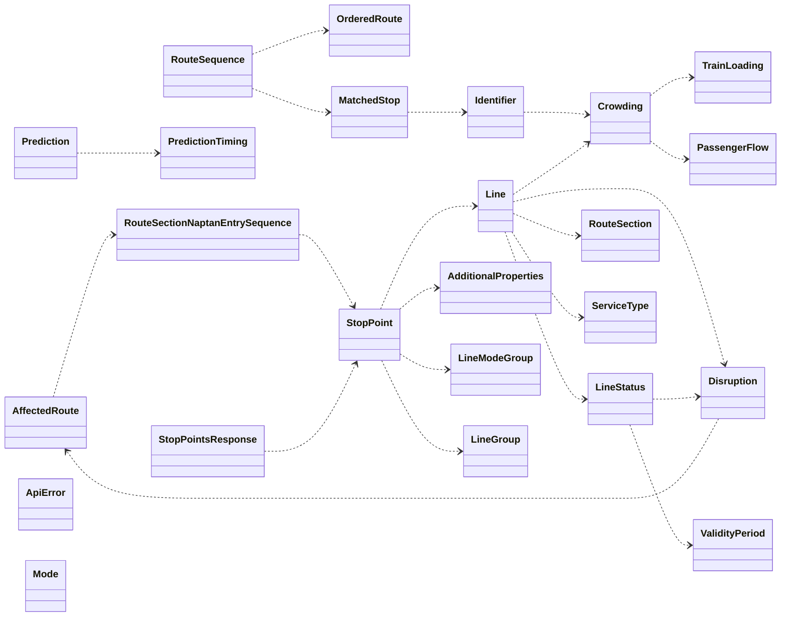

# pydantic tfl api

I originally used [TfL-python-api](https://github.com/dhilmathy/TfL-python-api) by @dhilmathy but that verision depends on the [msrest](https://github.com/Azure/msrest-for-python) package, which has been deprecated for 2+ years. I have created this package to replace it, using pydantic and requests.

This API returns data from the TfL API in a more pythonic way, using pydantic models. It's a thin wrapper around the TfL API, so you can use the TfL API documentation to see what data is available.

## Installation

```bash
pip install pydantic-tfl-api
```

## Usage

Uses Pydantic so you can use the `model_dump_json()` method to fully expand all the objects in the result. See [Pydantic documentation](https://docs.pydantic.dev/latest/) for more help.

```python
from pydantic_tfl_api.client import Client, ApiToken

app_id = 'APPLICATION ID'
app_key = 'APPLICATION KEY'

token = ApiToken(app_id, app_key)

client = Client(token)
print (client.get_line_meta_modes())
print (client.get_lines(mode="bus")[0].model_dump_json())
print (client.get_lines(line_id="victoria")[0].model_dump_json())
print (client.get_route_by_line_id_with_direction(line_id="northern", direction="all").model_dump_json())
```
## Class structure

The Pydantic classes are in the `tfl.models` module. The `tfl.client` module contains the `Client` class, which is the main class you will use to interact with the API.

Pydantic models are used to represent the data returned by the TfL API. There is a circular reference in the TfL API, so I handled this in the `StopPoint` model to load the `Line` model only after `StopPoint` is fully loaded.

The following objects represent responses from the TfL API, and are therefore returned by the `Client` class methods - either individually or as an array of objects:

- `StopPoint`
- `Mode`
- `Line`
- `RouteSequence`
- `Disruption`
- `StopPointsResponse`
- `Prediction`

These objects contains a property `content_expires` which is a `. This is calculated from the headers of the response. You can use these to calculate the time to live of the object, and to determine if the object is still valid - for example if implementing caching.

Here's a Mermaid visualisation of the Pydantic models:

