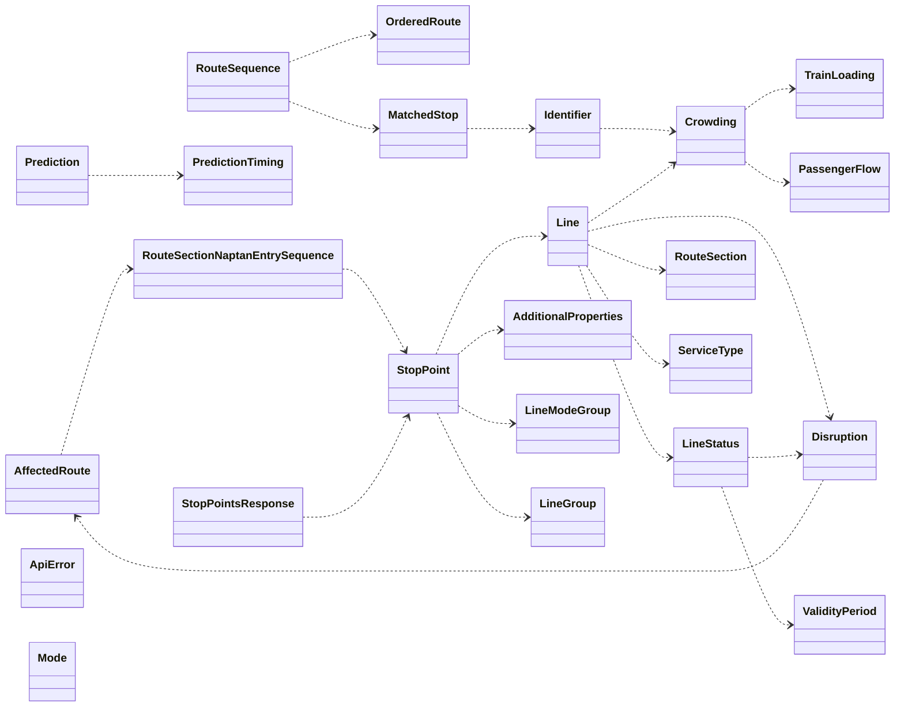

# pydantic tfl api

I originally used [TfL-python-api](https://github.com/dhilmathy/TfL-python-api) by @dhilmathy but that verision depends on the [msrest](https://github.com/Azure/msrest-for-python) package, which has been deprecated for 2+ years. I have created this package to replace it, using pydantic and requests.

This API returns data from the TfL API in a more pythonic way, using pydantic models. It's a thin wrapper around the TfL API, so you can use the TfL API documentation to see what data is available.

## Installation

```bash
pip install pydantic-tfl-api
```

or

```bash
poetry add pydantic-tfl-api
```

## Usage

Uses Pydantic so you can use the `model_dump_json()` method to fully expand all the objects in the result. See [Pydantic documentation](https://docs.pydantic.dev/latest/) for more help.

You can obtain an API key from [your profile page on the API portal](https://api-portal.tfl.gov.uk/profile) although you only need this if doing more than a dozen or so requests per minute.

```python
from pydantic_tfl_api.client import Client

token = "your_secret_token from https://api-portal.tfl.gov.uk/profile"

client = Client(token)
print (client.get_line_meta_modes())
print (client.get_lines(mode="bus")[0].model_dump_json())
print (client.get_lines(line_id="victoria")[0].model_dump_json())
print (client.get_route_by_line_id_with_direction(line_id="northern", direction="all").model_dump_json())
```
## Class structure

The Pydantic classes are in the `tfl.models` module. The `tfl.client` module contains the `Client` class, which is the main class you will use to interact with the API.

Pydantic models are used to represent the data returned by the TfL API. There is a circular reference in the TfL API, so I handled this in the `StopPoint` model to load the `Line` model only after `StopPoint` is fully loaded.

The following objects represent responses from the TfL API, and are therefore returned by the `Client` class methods - either individually or as an array of objects:

- `StopPoint`
- `Mode`
- `Line`
- `RouteSequence`
- `Disruption`
- `StopPointsResponse`
- `Prediction`

These objects contains two properties `content_expires` and `shared_expires`, which are the calculated expiry based on the HTTP response timestamp and the `maxage`/`s-maxage` header respectively. You can use these to calculate the time to live of the object, and to determine if the object is still valid - for example if implementing caching.

Here's a Mermaid visualisation of the Pydantic models (or [view online](https://mermaid-js.github.io/mermaid-live-editor/edit#pako:eNqNVE1r4zAQ_StG59AfkMNC2XaXhXQ3xKGHxRdhTZIBW9KOpJZQ-t9Xlhxbkl3aHBzpzXvzpWHeWKsEsC1rO27MA_Iz8b6Rlf8JJGgtKlntDhEJnOr-dPI4iINyFlJDAOqo-c215fJRWrrW8M-BbEdqpq7u7r59Lktj7AkEBuoRe5TndVtE53uIU0qr3PN3Uq-i9Og_IM9APzr1mhqOxFHuFJ8FN3kMtdRl9lyeOv4lQFo8IVBE53sQzkmmoj8kgD5-kLT90fDEbXsBUVulI5wxQ6QvUPKw2YhofCRSlMX0czawUmyHcsxrOAWnD2jI6fkRJ8NwqC23zhSGdH4KUw30gi0cr7oMs97IpauIL_xE-Jl3KNBe90CoRFlYmmxE09oy977Je4XSroLmAEYrabLQ98IH9o54tyelgSyC-bp6SG94j5-knC4NIzi_1VxMaN1a1QVlWeiMBMLKDkkGLlCSyb85-WRTxCefexlFEzBNUVL10li0JSd83PWlowKf3iHPkm1YD9RzFH4Hvw2ahtkL9NCwrT9KcJZ417BGvnsqd1bVV9myrSUHG-bzPF_Y9sQ7429OC25h3OET6peeVfQ0bvnhb8M0l3-VunHe_wMvtQ55)):



# Development environment

The devcontainer is set up to use the `poetry` package manager. You can use the `poetry` commands to manage the environment. The `poetry.lock` file is checked in, so you can use `poetry install --with dev --no-interaction --sync --no-root` to install the dependencies (which the devcontainer does on the `postCreateCommand` command).